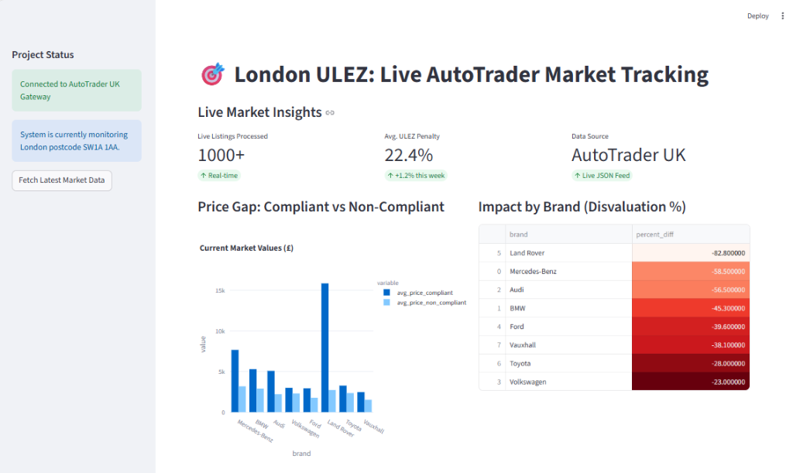
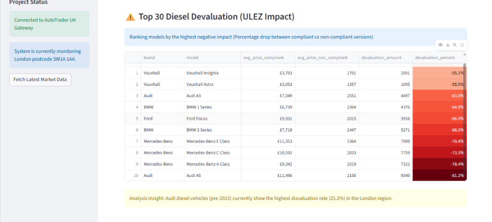
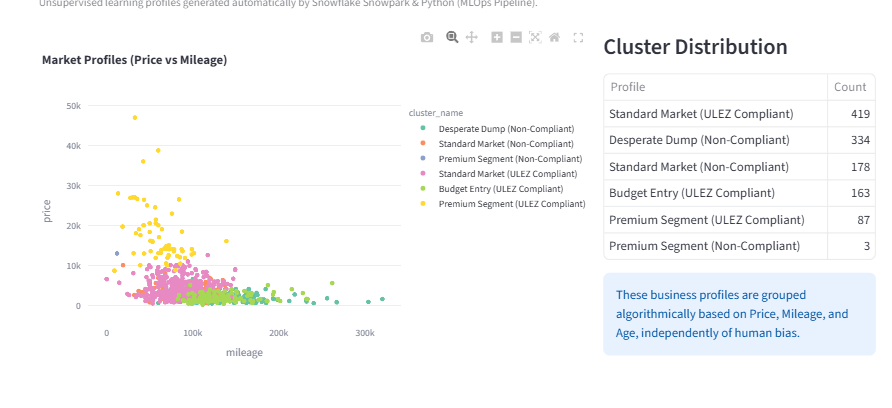
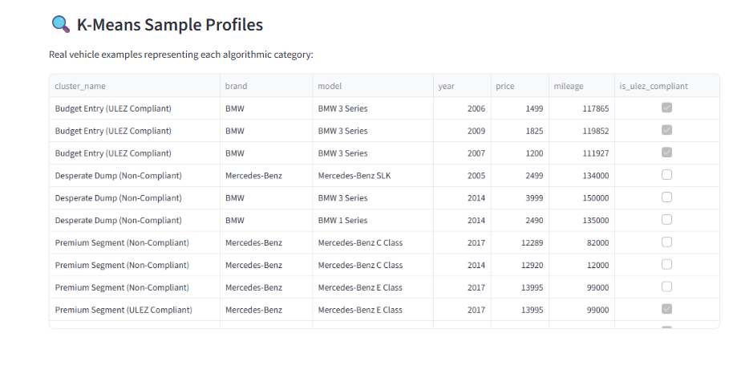
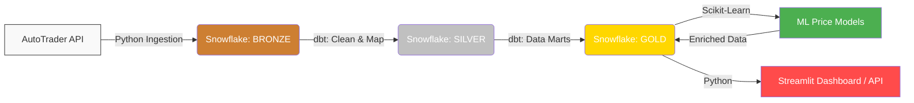

# 🚗 London ULEZ Expansion: Used Car Market Impact Analysis

This end-to-end Data Engineering and Analytics project investigates the economic effects of the Ultra Low Emission Zone (ULEZ) expansions on the UK used car market. Specifically, it analyzes how the policy affected non-compliant diesel vehicle prices compared to compliant ones.

## 📊 Analytics & Insights

*Live market metrics and price gap analysis between compliant and non-compliant vehicles.*

*Detailed ranking of top 30 diesel models most affected by the ULEZ expansion.*

*K-Means clustering algorithm segmenting the market based on price, mileage, and explicitly calculating ULEZ Compliance impact.*

*Real vehicles dynamically classified into each cluster directly from the Snowflake data warehouse.*

## 🏗️ Data Engineering Architecture

The project tracks real-world data and implements a robust **Medallion Architecture** on Snowflake using the modern data stack.

### The Data Pipeline
1. **Bronze Layer (Raw Data):** 
   - A custom Python orchestrator (`scripts/data_engine.py`) extracts near real-time listings from the AutoTrader GraphQL API.
   - Pushes raw attributes to Snowflake using internal stages, allowing continuous ingestion streams.

2. **Silver Layer (Staging & Cleansing):** 
   - Standardizes the data types using **dbt** (`dbt_project/models/staging`).
   - Establishes ULEZ compliance business logic based on vehicle year, emissions, and fuel-type constraints.

3. **Gold Layer (Business Data Marts):** 
   - Aggregates and materializes analysis-ready facts and dimensions via **dbt** (`dbt_project/models/marts`).
   - Serves analytical views (e.g. `mart_diesel_devaluation`) for direct visualization.

4. **Machine Learning:**
   - Evaluates price erosion using regression models based on ULEZ compliance status.

## 🗂️ Project Structure
- `snowflake/`: SQL configurations for roles, warehouses, streams, and tasks.
- `dbt_project/`: Transformation logic (Bronze -> Silver -> Gold).
- `scripts/`: Custom data collectors and the operational data engine.
- `ml_analysis/`: Python-based clustering and price prediction scripts.
- `app/`: Frontend Streamlit application and APIs connecting to Snowflake.

## 🛠️ Technology Stack
- **Data Warehouse:** Snowflake
- **Transformations:** dbt
- **Ingestion Engine:** Python
- **Frontend / API:** Streamlit, FastAPI

## 📝 Core Research Questions
1. Did the ULEZ expansion accelerate the depreciation of non-compliant diesel vehicles?
2. What is the average financial penalty for holding an older diesel car post-2023?
3. How accurately can we predict selling patterns depending on the ULEZ bracket?
