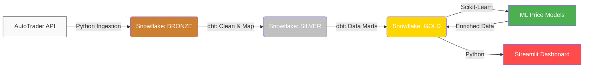

# 🚗 London ULEZ Expansion: Used Car Market Impact Analysis

[](https://github.com/S4LL77/london-ulez-car-analysis/actions/workflows/ci.yml)
[](https://www.python.org/downloads/)
[](https://github.com/astral-sh/ruff)
[](https://opensource.org/licenses/MIT)

This end-to-end Data Engineering and Analytics project investigates the economic effects of the Ultra Low Emission Zone (ULEZ) expansions on the UK used car market.

## 📊 Analytics & Insights


*Live market metrics and price gap analysis between compliant and non-compliant vehicles.*

---

## 🏗️ Data Engineering Architecture

The project tracks real-world data and implements a robust **Medallion Architecture** on Snowflake.



### ❄️ Snowflake Infrastructure (IaC)
The environment is configured via SQL scripts in `snowflake/setup/` which follow professional standards:
- **Role-Based Access Control (RBAC):** Implemented via `ULEZ_ADMIN` and `ULEZ_DEVELOPER` roles, hierarchically linked to `SYSADMIN`.
- **Medallion Schema:** Separate schemas for `BRONZE` (Raw), `SILVER` (Staging), and `GOLD` (Marts).
- **Warehouse Management:** Uses `ULEZ_WH` (X-Small) with auto-suspend to optimize cost-efficiency.

### 🔄 The Data Pipeline
1. **Bronze Layer (Ingestion):** 
   - Custom Python orchestrator (`scripts/data_engine.py`) extracts near real-time listings from the **AutoTrader GraphQL API**.
   - Handles data extraction, deduplication, and staging into Snowflake.
2. **Silver Layer (Transformation):** 
   - **dbt** models clean and standardize raw data.
   - Business logic defines ULEZ compliance (Euro 4+ for petrol, Euro 6+ for diesel).
3. **Gold Layer (Analytics):** 
   - Materialized views for "Diesel Devaluation" ranking and market trends.
   - Serves as the source of truth for the **Streamlit Dashboard**.

### 🛠️ Maintenance & Applying Changes
When analytical logic is updated (e.g., changing ranking limits or sorting criteria):
1. **Infrastructure Update**: You must re-run the corresponding SQL script in `snowflake/setup/` via the Snowflake console.
2. **App Trigger**: The Streamlit dashboard (Cloud or Local) will automatically pick up the new logic once the view is updated in the database.
3. **Cache Clearing**: If data doesn't update immediately, press **`C`** on the Streamlit dashboard to clear its internal cache.

---

## 🛡️ Quality Assurance & CI/CD

To ensure production-grade reliability, the project includes:
- **Linting & Formatting:** Powered by **Ruff** (modern, ultra-fast Python linter).
- **Unit Testing:** **Pytest** with mocks to validate API ingestion and data processing logic.
- **GitHub Actions:** Every push triggers a CI pipeline that runs linting and tests automatically.

### Running Tests Locally
```bash
pip install -r requirements.txt
python -m pytest tests/
```

---

## 🛠️ Technology Stack
- **Warehouse:** Snowflake
- **Transformations:** dbt (Snowflake-adapter)
- **Programming:** Python 3.10+, SQL
- **CI/CD:** GitHub Actions, Ruff
- **Dashboard:** Streamlit
- **ML:** Scikit-Learn (K-Means Clustering)
